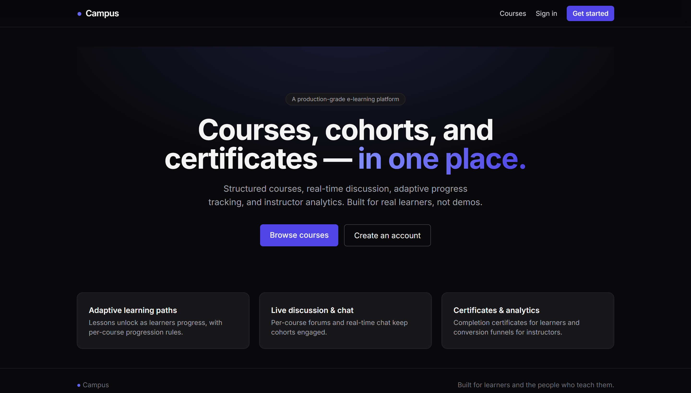
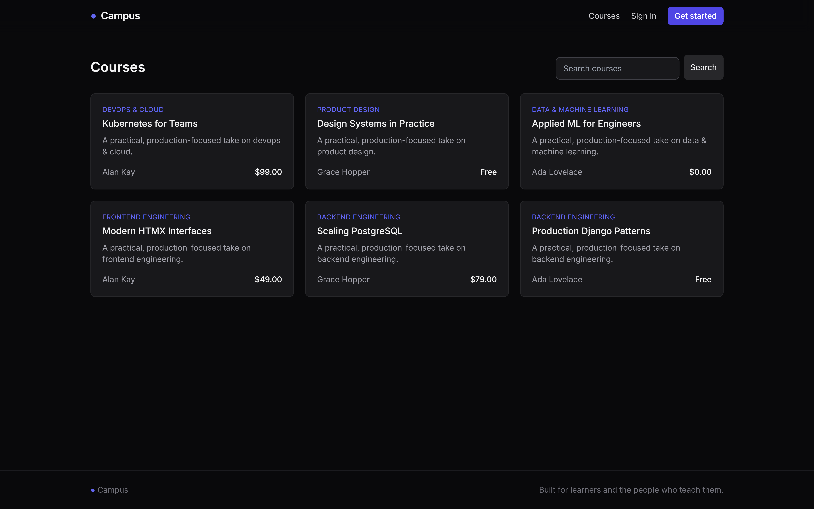
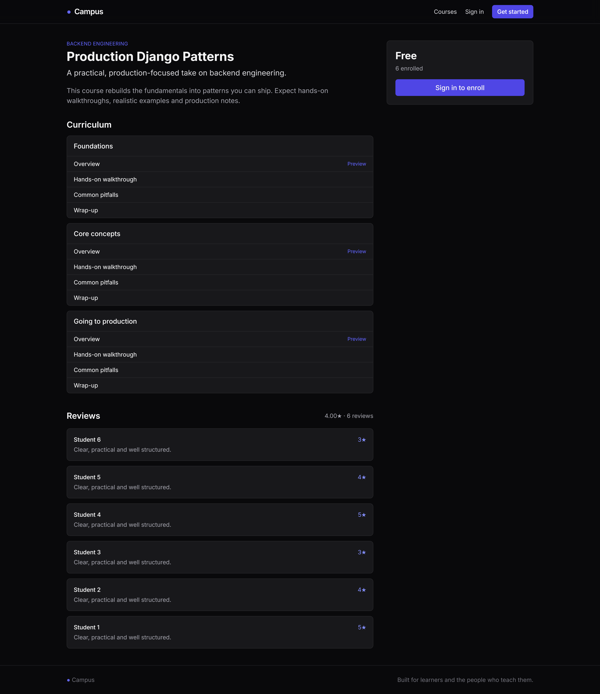
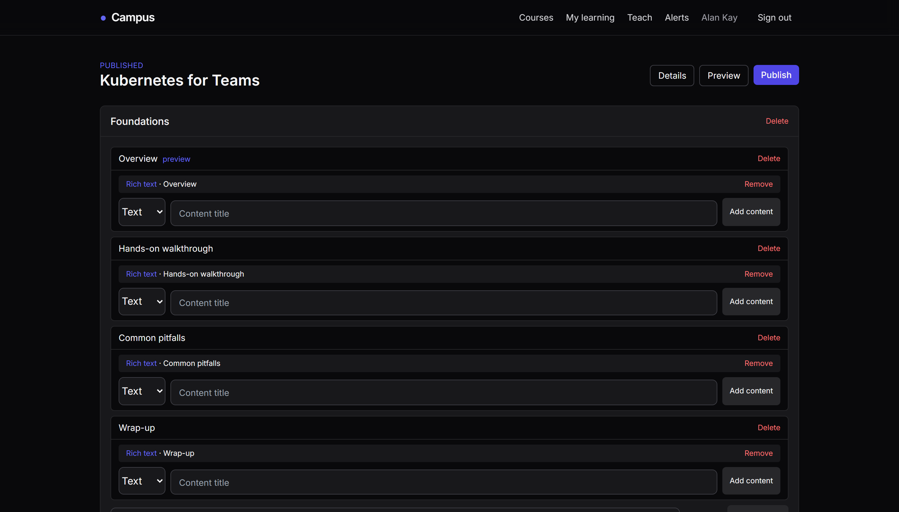
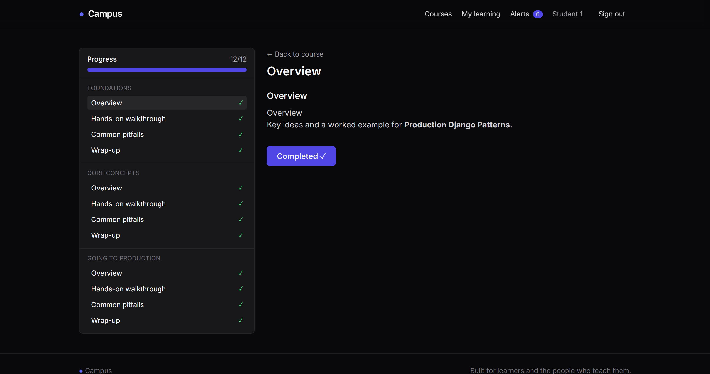
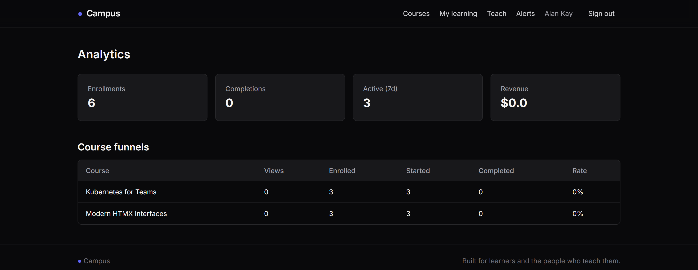

# Campus

A production-grade e-learning platform: structured courses, adaptive progress,
real-time discussion and chat, payments, certificates, a versioned REST API and
instructor analytics.

## Demo & screenshots

A walkthrough — browsing the catalog, a course's curriculum, the instructor's HTMX
course builder, and the learner classroom with adaptive progress tracking.

<p align="center">
  
</p>

<p align="center">
  
</p>

| Course catalog | Course curriculum |
| :---: | :---: |
|  |  |

| Instructor course builder (HTMX) | Learner classroom & progress |
| :---: | :---: |
|  |  |

<p align="center">
  
</p>

## Highlights

- **Courses & CMS** — subjects, courses with a draft → review → published workflow,
  modules, lessons and polymorphic content (text / video / file / embed) managed
  through an HTMX course builder.
- **Adaptive progression** — pluggable progression policies (open or sequential)
  gate lesson access per course; completion is tracked per lesson and rolled up to
  the enrollment.
- **Payments** — Stripe checkout for one-time course purchases and subscriptions,
  with signature-verified, idempotent webhooks.
- **Real time** — per-course chat and live notifications over WebSockets (Django
  Channels).
- **Engagement** — discussion forums, course reviews with aggregated ratings, and
  asynchronously rendered completion certificates (PDF).
- **API** — versioned Django Ninja API at `/api/v1` with JWT auth and OpenAPI docs.
- **Analytics** — an event stream, nightly rollups, instructor funnels and learner
  stats.

## Tech stack

Python 3.13 · Django 5.2 · Django Ninja · PostgreSQL 17 · Redis · Celery ·
Django Channels · HTMX · Alpine.js · TailwindCSS · Docker · uv · pytest · Ruff.

## Quickstart (development)

```bash
cp .env.example .env            # adjust secrets as needed
make build                      # build the image
make up                         # start postgres, redis, django, celery
make migrate                    # apply migrations
make seed                       # load realistic demo data (password: Test1234!pw)
```

The app runs at http://localhost:8000 and auto-reloads on file changes.
API docs are at http://localhost:8000/api/v1/docs.

Common tasks:

```bash
make test     # run the test suite
make lint     # ruff
make logs     # tail django logs
make shell    # django shell
```

> Tooling runs inside Docker via `uv` (e.g. `docker compose exec django uv run ...`).
> After adding a new app or file, restart the django container so the dev server
> picks it up: `docker compose restart django`.

## Project layout

```
config/            settings (base/development/production/testing), urls, asgi/wsgi, routing
core/              enums, RBAC permissions, health check
shared/            base models (UUID + audit + soft delete), exceptions, cache, pagination, realtime
infrastructure/    Celery app
apps/
  accounts         custom user, roles, auth, seed command
  catalog          subjects, courses, publishing
  content          modules, lessons, content items, builder
  enrollment       enrollment + access gating
  progress         lesson progress + adaptive progression engine
  payments         Stripe plans, subscriptions, orders, webhooks
  notifications    in-app + email + WebSocket notifications
  chat             realtime course chat
  forums           discussion threads
  reviews          course ratings
  certificates     async PDF certificates
  analytics        event stream, rollups, dashboards
api/v1/            Django Ninja routers, JWT auth, schemas
templates/         server-rendered UI (Tailwind + HTMX + Alpine)
tests/             unit / integration / api / ws / factories
```

## Architecture & deployment

See [ARCHITECTURE.md](ARCHITECTURE.md) for the design rationale and
[DEPLOYMENT.md](DEPLOYMENT.md) for the production setup.
